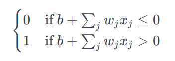
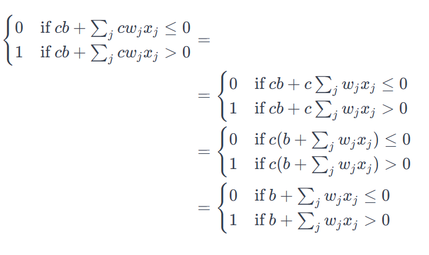
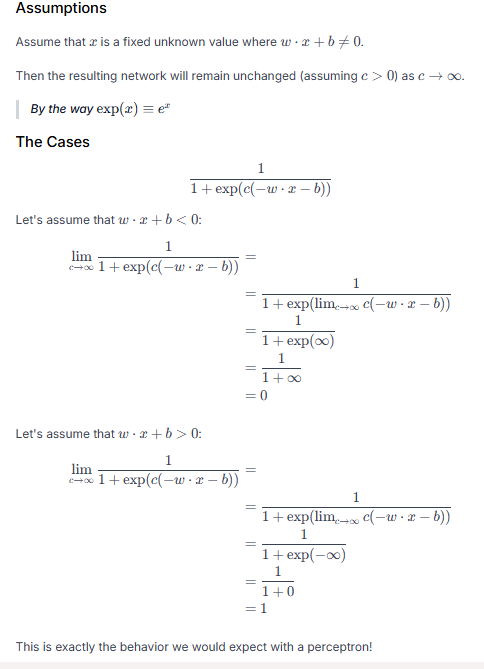
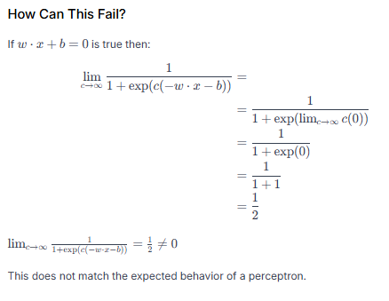

# Exercises

### Sigmoid neurons simulating perceptrons, part I Suppose we take all the weights and biases in a network of perceptrons, and multiply them by a positive constant, c>0. Show that the behaviour of the network doesn't change.

The definition of perceptron is -

now if we mutiply each weight and bias by a positive constant c

We end up back where we started from and thus multiplying by a constant cc (assuming c > 0) does not affect the behavior of the network.

### Sigmoid neurons simulating perceptrons, part II Suppose we have the same setup as the last problem - a network of perceptrons. Suppose also that the overall input to the network of perceptrons has been chosen. We won't need the actual input value, we just need the input to have been fixed. Suppose the weights and biases are such that w⋅x+b≠0 for the input x to any particular perceptron in the network. Now replace all the perceptrons in the network by sigmoid neurons, and multiply the weights and biases by a positive constant c > 0. Show that in the limit as c→∞ the behaviour of this network of sigmoid neurons is exactly the same as the network of perceptrons. How can this fail when w⋅x+b=0 for one of the perceptrons?

### There is a way of determining the bitwise representation of a digit by adding an extra layer to the three-layer network above. The extra layer converts the output from the previous layer into a binary representation, as illustrated in the figure below. Find a set of weights and biases for the new output layer. Assume that the first 3 layers of neurons are such that the correct output in the third layer (i.e., the old output layer) has activation at least 0.99, and incorrect outputs have activation less than 0.01.
