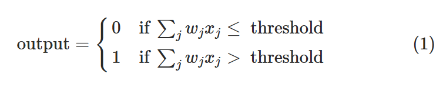
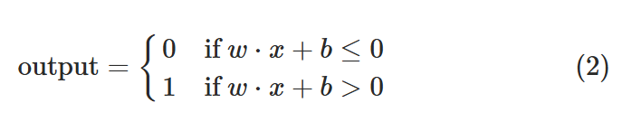
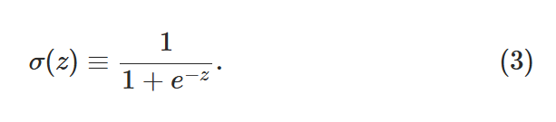
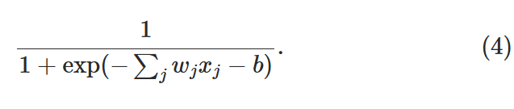
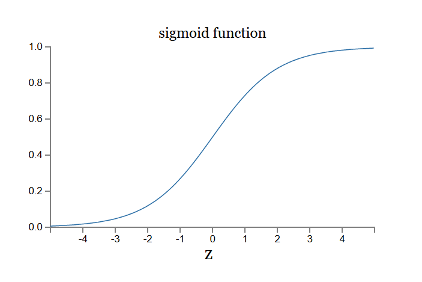
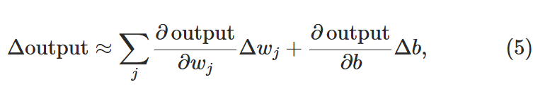

# Chapter 1 - Using neural nets to recognize handwritten digits

### Perceptrons

A perceptron takes several binary inputs, x1, x2, …, and produces a single binary output:

Weights (w1,w2,…) - real numbers expressing the importance of the respective inputs to the output.

In the example shown the perceptron has three inputs, x1, x2, x3.The neuron's output, 0 or 1, is determined by whether the weighted sum is less than or greater than some threshold value.

A complex network of perceptrons could make quite subtle decisions:

First layer of perceptrons - making three very simple decisions, by weighing the input evidence.

Second layer - making a decision by weighing up the results from the first layer of decision-making. This way a perceptron in the second layer can make a decision at a more complex and more abstract level than perceptrons in the first layer.

Redefining perceptrons with two changes -

- first change is to write ∑ wj _ xj as a dot product, w⋅x ≡ ∑ wj _ xj, where w and x are vectors whose components are the weights and inputs, respectively.
- The second change is to move the threshold to the other side of the inequality, and to replace it by what's known as the perceptron's bias, b ≡ −threshold

Bias - a measure of how easy it is to get the perceptron to output a 1. For a perceptron with a really big bias, it's extremely easy for the perceptron to output a 1. But if the bias is very negative, then it's difficult for the perceptron to output a 1.

Perceptrons as logic gates-
Suppose we have a perceptron with two inputs, each with weight −2, and an overall bias of 3.

Then we see that input x1 = 0 and x2 = 0 produces output 1, since (-2) ∗ 0 + (-2) ∗ 0 + 3 = 3 is positive. Similar calculations show that the inputs x1 = 0, x2 = 1 and x1 = 1, x2 = 0 produce output 1. But the input 11 produces output 0, since (-2) ∗ 1 + (-2) ∗ 1 + 3 = −1 is negative. And so our perceptron implements a NAND gate!

We can use networks of perceptrons to compute any logical function at all.
or example, we can use NAND gates to build a circuit which adds two bits, x1 and x2. This requires computing the bitwise sum, x1 ⊕ x2, as well as a carry bit which is set to 1 when both x1 and x2 are 1, i.e., the carry bit is just the bitwise product x1 \* x2

To get an equivalent network of perceptrons we replace all the NAND gates by perceptrons with two inputs, each with weight −2, and an overall bias of 3.

an updated version with one weight of -4 (instead of having two -2 weights) and inputs as input layer (instead od just variables)

### Sigmoid Neurons

How can we devise a learning algorithms for neural networks?
For example, the inputs to the network might be the raw pixel data from a scanned, handwritten image of a digit. And we'd like the network to learn weights and biases so that the output from the network correctly classifies the digit. To see how learning might work, suppose we make a small change in some weight (or bias) in the network. What we'd like is for this small change in weight to cause only a small corresponding change in the output from the network.

A small change in a weight (or bias) causes only a small change in output, then we could use this fact to modify the weights and biases to get our network to behave more in the manner we want.

The problem is that this isn't what happens when our network contains perceptrons. In fact, a small change in the weights or bias of any single perceptron in the network can sometimes cause the output of that perceptron to completely flip, say from 0 to 1. That flip may then cause the behaviour of the rest of the network to completely change in some very complicated way.

Sigmoid neurons - similar to perceptrons, but modified so that small changes in their weights and bias cause only a small change in their output.

Can be visualized similar to perceptron -

the sigmoid neuron has inputs, x1,x2,…. But instead of being just 0 or 1, these inputs can also take on any values between 0 and 1. Also just like a perceptron, the sigmoid neuron has weights for each input, w1,w2,…, and an overall bias, b. But the output is not 0 or 1. Instead, it's σ(w⋅x+b), where σ is called the sigmoid function.

output of a sigmoid neuron with inputs x1,x2,…, weights w1,w2,…, and bias b

Similarity with perceptron -

- Suppose z≡w⋅x+b is a large positive number. Then e^ (−z) ≈ 0 and so σ(z)≈1. Output of sigmoid neuron is approximately 1, just as it would have been for a perceptron.

- Suppose on the other hand that z=w⋅x+b is very negative. Then e ^ (−z) → ∞, and σ(z) ≈ 0, similar to what perceptron would give.

- It's only when w⋅x+b is of modest size that there's much deviation from the perceptron model.

The smoothness of σ means that small changes Δwj in the weights and Δb in the bias will produce a small change Δoutput in the output from the neuron. In fact, calculus tells us that Δoutput is well approximated by

Δoutput is a linear function of the changes Δwj and Δb in the weights and bias. This linearity makes it easy to choose small changes in the weights and biases to achieve any desired small change in the output. So while sigmoid neurons have much of the same qualitative behaviour as perceptrons, they make it much easier to figure out how changing the weights and biases will change the output.

### The architecture of neural networks

Leftmost layer - input layer\
Rightmost layer - output layer\
Everything in between - hidden layers

These multiple layer networks are called MLPs or multilayer perceptrons.

Feedforward neural networks - neural networks where the output from one layer is used as input to the next layer

Recurrent neural networks - artificial neural networks in which feedback loops are possible

### A simple network to classify handwritten digits

input - 28 x 28 px - (784 neurons)\
output - 10 neurons (0 to 9)\
hidden - n (for now n = 15)
